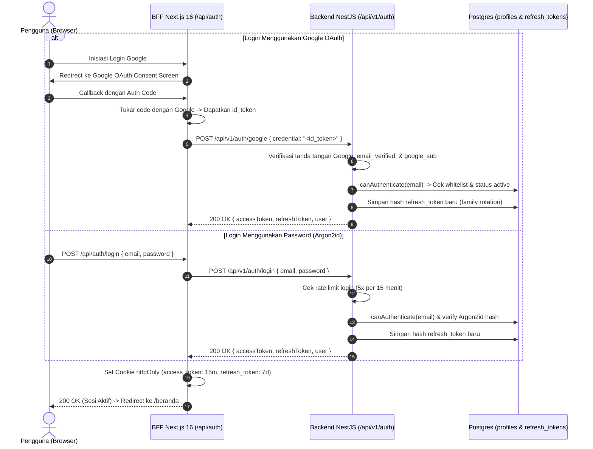
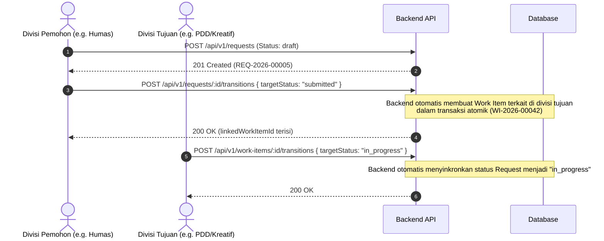
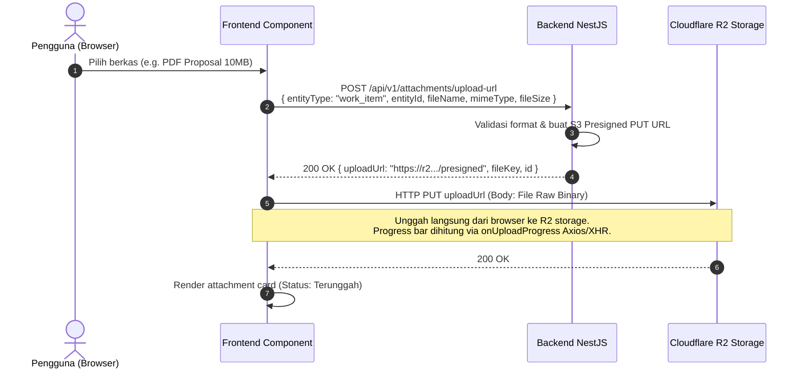
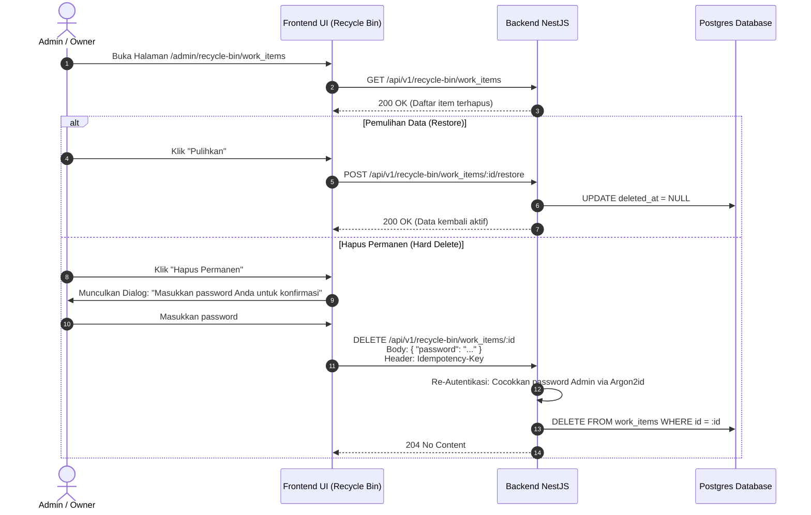

# Alur Integrasi Backend ke Frontend (FE Integration Guide)
**SamudraKarsaWorkSpace** · Arsitektur BFF Next.js 16 ↔ NestJS API · Kontrak REST OpenAPI 3.1 & RFC 7807
Dokumen ini disusun sebagai panduan menyeluruh bagi tim pengembang Frontend (FE) untuk mengonsumsi dan memproses seluruh kapabilitas backend yang telah selesai dibangun (Fase 1 s.d. Fase 8).

---

## 1. Arsitektur Sambungan Sistem: Browser ↔ BFF ↔ Backend

Sistem Samudra Karsa mengadopsi pola **Backend-for-Frontend (BFF)** terpisah untuk menjamin zero-trust security dan mencegah paparan token di sisi browser (Keputusan 31 & PRD-SISTEM §3).

```
┌─────────────────────────────────────────────────────────────────────────────────┐
│ BROWSER (Client Side)                                                           │
│ - Tidak pernah memanggil NestJS API secara langsung                             │
│ - Tidak pernah membaca database atau memegang token JWT                         │
│ - Cookie httpOnly terpasang otomatis (first-party)                              │
└───────────────────────────────────────┬─────────────────────────────────────────┘
                                        │ /api/* (Same Origin)
                                        ▼
┌─────────────────────────────────────────────────────────────────────────────────┐
│ BFF NEXT.JS 16 (App Router)                                                     │
│ - Lapis 1: `proxy.ts` (verifikasi eksistensi cookie & origin check)             │
│ - Lapis 2: `(app)/layout.tsx` -> `verifySession()`                              │
│ - Mengelola cookie httpOnly: access_token (15m) & refresh_token (7d)            │
│ - Meneruskan request server-to-server ke NestJS API via Bearer Header           │
└───────────────────────────────────────┬─────────────────────────────────────────┘
                                        │ /api/v1/* (Authorization: Bearer <token>)
                                        ▼
┌─────────────────────────────────────────────────────────────────────────────────┐
│ BACKEND NESTJS API (`SamudraKarsaWorkSpace-api`)                                │
│ - CORS: `origin: false` (Semua direct browser call otomatis ditolak)            │
│ - Header Keamanan: Helmet CSP kustom (default-src 'none'), frame-ancestors none │
│ - Guard Otomatis: `PolicyGuard` (154 rute dijaga, 5 rute publik)                │
│ - Rate Limiter: Tabel Postgres terdistribusi (`rate_limits`)                    │
│ - Database: Supabase Postgres via Transaction Pooler                            │
│ - File Storage: Cloudflare R2 via Presigned URLs                                │
└─────────────────────────────────────────────────────────────────────────────────┘
```

### 1.1 Standar Header HTTP Antara BFF ↔ Backend
Setiap request dari BFF (`src/app/api/**` atau Server Components) ke NestJS API wajib menyertakan:
1. **`Authorization: Bearer <access_token>`** (Kecuali untuk 5 endpoint publik `@Public()`).
2. **`X-Request-Id`**: UUIDv4 unik per request pengguna. Di-forward ke backend dan dikembalikan di respons RFC 7807 jika terjadi error. Tampilkan ID ini di dialog UI error.
3. **`If-Match: "<version>"`**: **Wajib** disertakan pada setiap request `PATCH` yang mendukung optimistic locking.
4. **`Idempotency-Key: <uuidv4>`**: **Wajib** disertakan pada aksi rawan duplikasi:
   - Pembuatan Request (`POST /api/v1/requests`)
   - Transisi Status (`POST /api/v1/work-items/:id/transitions`, `POST /api/v1/requests/:id/transitions`, dll.)
   - Hapus Permanen Tempat Sampah (`DELETE /api/v1/recycle-bin/:table/:id`)
   - Pembuatan Ekspor Laporan (`GET/POST /api/v1/reports/export/:table`)

---

## 2. Kontrak Error RFC 7807 (`application/problem+json`)

Semua kegagalan HTTP dari backend dikembalikan dalam format standar RFC 7807:

```json
{
  "type": "https://api.samudrakarsa.app/problems/validation-failed",
  "title": "Data yang dikirim tidak valid",
  "status": 422,
  "detail": "Field 'completionSummary' wajib diisi saat menyelesaikan pekerjaan.",
  "instance": "/api/v1/work-items/0191e4b8-2a00-7000-8000-000000000001/transitions",
  "requestId": "f8a12bc4-8712-4d22-921c-abc123def456",
  "code": "VALIDATION_FAILED",
  "errors": [
    {
      "field": "completionSummary",
      "code": "required",
      "message": "completionSummary wajib diisi"
    }
  ]
}
```

### 2.1 Matriks Penanganan Error di Frontend (FE Error Handling)

| Status | Makna di Backend | Perilaku & Tampilan UI Frontend |
|---|---|---|
| **400** | Permintaan malformed / syntax error | Tampilkan dialog modal error: *"Terjadi kesalahan format data"* + tampilkan tombol *Salin Request ID*. |
| **401** | Token tidak valid / kedaluwarsa | BFF mencoba silent refresh ke `POST /api/v1/auth/refresh`. Jika refresh gagal, cabut cookie dan alihkan browser ke `/masuk`. |
| **403** | Akses ditolak / penanda `mustChangePassword` | - Jika `code === "must_change_password"`: Alihkan paksa browser ke `/ganti-password`.<br>- Jika peran tidak sah: Tampilkan halaman *"Anda tidak memiliki akses"* (seharusnya tidak pernah muncul jika UI sudah menyembunyikan tombol). |
| **404** | Resource tidak ditemukan **atau** data milik entitas/divisi lain | Tampilkan Empty State: *"Data tidak ditemukan"*. **Catatan Keamanan:** Backend mengembalikan 404 (bukan 403) untuk data privat divisi lain atau keuangan agar tidak membocorkan keberadaan resource. |
| **409** | Konflik Versi (`version_mismatch`) atau Konflik Sinkronisasi | Tampilkan dialog peringatan: **"Data sudah diperbarui oleh orang lain. Silakan muat ulang untuk mendapatkan versi terbaru."** dengan tombol *"Muat Ulang Halaman"*. |
| **422** | Validasi skema Zod gagal | Petakan array `errors[]` langsung ke inline feedback field form di `react-hook-form` (`setError(err.field, { message: err.message })`). |
| **428** | `If-Match` header hilang | Terjadi jika FE lupa menyertakan header versi pada `PATCH`. Ini bug FE. |
| **429** | Rate limit terlampaui | Ambil header `Retry-After`. Tampilkan peringatan: *"Terlalu banyak permintaan. Silakan tunggu X detik sebelum mencoba lagi."* Kunci tombol sementara. |
| **500** | Kesalahan internal server | Tampilkan state kegagalan generik yang ramah: *"Terjadi kendala pada sistem. Silakan coba beberapa saat lagi"* + cantumkan `requestId`. Jangan tampilkan trace teknis. |

---

## 3. Alur Autentikasi & Manajemen Sesi (Auth Flow)

Sistem menggunakan model **autentikasi tertutup** (Keputusan 10 & 26). Hanya akun yang telah didaftarkan sebelumnya oleh Admin/Owner di tabel `profiles` yang diizinkan masuk.



### 3.1 Detail Endpoint Autentikasi

| Endpoint | Method | Akses | Payload Request | Response Penting | Catatan Frontend |
|---|---|---|---|---|---|
| `/auth/google` | `POST` | `@Public()` | `{ credential: string }` | `{ accessToken, refreshToken, user }` | BFF mengirim raw `id_token` dari Google OAuth. |
| `/auth/login` | `POST` | `@Public()` | `{ email, password }` | `{ accessToken, refreshToken, user }` | Password diverifikasi dengan Argon2id. Rate limit 5 req / 15 min. |
| `/auth/refresh` | `POST` | `@Public()` | `{ refreshToken: string }` | `{ accessToken, refreshToken }` | Memakai rotasi token. Token reuse akan mencabut seluruh token family! |
| `/auth/session` | `GET` | Bearer Token | - | `SessionResult` | Dipanggil oleh `verifySession()` di layout utama. |
| `/auth/change-password` | `POST` | Bearer Token | `{ currentPassword, newPassword }` | `{ success: true }` | Digunakan saat `must_change_password === true` atau ubah password mandiri. |
| `/auth/logout` | `POST` | Bearer Token | `{ refreshToken?: string }` | `{ success: true }` | Mencabut keluarga refresh token dari DB. BFF menghapus cookie. |

### 3.2 Tipe Data `SessionResult` (`GET /api/v1/auth/session`)
Data ini dikonsumsi oleh `(app)/layout.tsx` untuk otorisasi tampilan:
```ts
interface SessionResult {
  readonly id: string;
  readonly email: string;
  readonly fullName: string | null;
  readonly roles: readonly ('owner' | 'co_owner' | 'division_head' | 'division_deputy' | 'member')[];
  readonly divisionCodes: readonly string[]; // Contoh: ["HUMAS", "KESTARI"]
  readonly mustChangePassword: boolean;
  readonly mustChangePasswordExempt: readonly string[];
}
```

### 3.3 Penanganan Khusus `must_change_password`
1. Ketika Admin mereset password anggota, anggota diberikan password sementara dan field `mustChangePassword: true`.
2. Saat login, `SessionResult.mustChangePassword` bernilai `true`.
3. Backend memblokir **seluruh endpoint** non-exempt dengan status `403` kode `must_change_password`.
4. **Alur FE:** Cek `session.mustChangePassword`. Jika `true` dan rute saat ini bukan `/ganti-password`, arahkan pengguna secara otomatis ke halaman `/ganti-password`.

---

## 4. Matriks Otorisasi & Peran (Role & Policy Matrix)

Sistem memiliki **5 Peran Hirarkis**:
1. `owner`: Ketua Pelaksana / Koordinator Utama KKN (Akses penuh seluruh domain).
2. `co_owner`: Wakil Ketua Pelaksana (Akses penuh mendampingi owner).
3. `division_head`: Kepala Divisi (Memiliki otoritas penuh atas modul dan anggota divisinya).
4. `division_deputy`: Wakil Kepala Divisi (Wewenang operasional **identik** dengan Kepala Divisi).
5. `member`: Anggota Divisi (Dapat melihat pekerjaan bersama, membuat pekerjaan/request, menyunting baris miliknya/divisinya).

### 4.1 Prinsip Desain Otorisasi untuk Frontend
> **Frontend HANYA Menyembunyikan Tombol / Navigasi (UX). Backend adalah Penegak Mutlak (Security).**
- Gunakan fungsi pembantu izin dari `@samudrakarsa/shared/policy` untuk menyembunyikan tombol (misal: `canEditWorkItem(actor, item).ok ? <TombolEdit /> : null`).
- Jangan pernah menulis logika otorisasi bisnis mandiri di FE.

---

## 5. Alur Domain Inti: Work Items & Requests (FSM & Dual Sync)

Domain pekerjaan (`work-items`) dan permintaan lintas divisi (`requests`) menggunakan **Finite State Machine (FSM) berbasis data** di tabel `status_transitions`.

### 5.1 Siklus Hidup Status (State Machine)

#### Work Items Status:
`draft` ➔ `submitted` ➔ `in_progress` ➔ `need_review` ➔ `need_clarification` ➔ `on_hold` ➔ `done` (atau `cancelled`)

#### Requests Status:
`draft` ➔ `submitted` ➔ `in_review` ➔ `need_clarification` ➔ `approved` / `rejected` ➔ `in_progress` ➔ `completed` ➔ `cancelled`

### 5.2 Kontrak Dinamis `availableTransitions` (Anti-Hardcoding Status)
Pada setiap respons detail `GET /api/v1/work-items/:id` dan `GET /api/v1/requests/:id`, backend menyertakan array:
```json
{
  "id": "0191e4b8-2a00-7000-8000-000000000001",
  "workNumber": "WI-2026-00012",
  "status": "in_progress",
  "version": 4,
  "availableTransitions": ["need_review", "on_hold"]
}
```
**Aturan FE:**
- Dropdown perubahan status pada modal/halaman detail **WAJIB dirender langsung dari array `availableTransitions`**.
- Terjemahkan value enum Inggris (`need_review`) menjadi label Indonesia ("Butuh Review") menggunakan kamus dictionary FE (`src/lib/dictionaries/id.ts`).
- Jika `availableTransitions` kosong (`[]`), sembunyikan atau nonaktifkan tombol aksi transisi status.

### 5.3 Validasi Field Wajib pada Form Transisi Status
Saat memanggil endpoint `POST /api/v1/work-items/:id/transitions` atau `POST /api/v1/requests/:id/transitions`:
- **Jika transisi ke `on_hold`:** Form dialog WAJIB meminta dan mengirim:
  - `holdReason`: Alasan penundaan (string, min 5 karakter)
  - `blockerReason`: Kendala teknis yang menghambat
  - `assistanceNeeded`: Bantuan yang diharapkan dari divisi lain/pimpinan
- **Jika transisi ke `done` / `completed`:** Form dialog WAJIB meminta:
  - `completionSummary`: Ringkasan hasil kerja nyata (string, min 10 karakter)
- Backend akan menolak dengan **422** jika field wajib ini tidak dikirimkan.

### 5.4 Sinkronisasi Otomatis Dua Arah (Request ↔ Work Item)



#### Penanganan Konflik Sinkronisasi (`sync_conflict_at`):
Jika status work item dan request diubah bersamaan secara bertolak belakang, backend menandai record dengan timestamp `sync_conflict_at` dan memblokir transisi reguler (`409 Conflict`).
- **Tampilan FE:** Tampilkan alert banner merah: *"Terdapat konflik sinkronisasi antara permintaan dan pekerjaan."*
- **Aksi Pemulihan:** Tampilkan tombol *"Selesaikan Konflik"* yang memanggil:
  `POST /api/v1/requests/:id/sync-conflict` dengan body `{ resolution: "sync_to_work_item" | "sync_to_request" }`.

### 5.5 Penugasan PIC & Penanganan PIC Nonaktif
- Penugasan PIC Utama: `PATCH /api/v1/work-items/:id/pic` `{ picId: "<uuid>" }`.
- Assignee Rekan Kerja: `assigneeIds` hanya boleh diisi oleh anggota yang berada dalam divisi yang sama (Keputusan 44).
- **Penanganan Anggota Nonaktif (Keputusan Desain):** Ketika anggota dinonaktifkan oleh Admin, backend **melepas (set to NULL)** seluruh posisi PIC yang dipegang anggota tersebut.
- **Filter Khusus di FE:** FE menyediakan tab filter *"Pekerjaan Tanpa PIC"* dengan query param `GET /api/v1/work-items?withoutPic=true` dan `GET /api/v1/requests?withoutPic=true` agar pimpinan divisi dapat segera menunjuk PIC pengganti.

---

## 6. Alur Penomoran Dokumen Tanpa Celah (Gapless Auto-Numbering)

Backend menjamin seluruh penomoran dokumen resmi berurutan tanpa celah transaksi (Keputusan 20 & PRD-BACKEND §8.2) menggunakan row-locking `SELECT ... FOR UPDATE` pada tabel `document_counters`.

| Entitas | Pola Format Nomor | Contoh Nomor | Keterangan |
|---|---|---|---|
| Pekerjaan | `WI-YYYY-#####` | `WI-2026-00001` | Dihasilkan saat pembuatan work item |
| Permintaan | `REQ-YYYY-#####` | `REQ-2026-00001` | Dihasilkan saat pengajuan request |
| Anggaran Keuangan | `RAB-YYYY-#####` | `RAB-2026-00001` | Dihasilkan saat proposal RAB dibuat |
| Inventaris Barang | `INV-#####` | `INV-00001` | Nomor inventaris tetap lintas periode |
| Surat Resmi Keluar | `SRT-<JENIS>-YYYY-#####` | `SRT-UND-2026-00001` | `<JENIS>` resmi: `UND` (Undangan), `PBM` (Pemberitahuan), `KTR` (Keterangan), `PNT` (Pengantar) |

> **Catatan FE:** Frontend tidak pernah memproduksi format nomor dokumen sendiri. Nomor dokumen selalu bersifat *read-only* dari database.

---

## 7. Alur Domain Pendukung & Layanan Media

### 7.1 Keuangan & Kas Anggota (`finance` & `dues`)
- **Akses Ketat:** Seluruh endpoint `/api/v1/finance/*` dan `/api/v1/dues/*` dijaga oleh guard `finance:read` dan `finance:write`.
- **Visibilitas Menu:** Sembunyikan menu *Keuangan* dari sidebar bagi pengguna selain `owner`, `co_owner`, dan pimpinan divisi bendahara.
- Jika pengguna non-keuangan mencoba mengakses URL langsung, backend merespons dengan **404 Not Found** (bukan 403) untuk menjaga privasi nominal kas organisasi.
- Pembacaan data keuangan otomatis dicatat di tabel `activity_logs` (`finance.viewed`) demi transparansi audit (Keputusan 39).

### 7.2 Domain Kolaboratif Tanpa PIC (`content`, `creative`, `partners`, `inventory`, `logistics`)
Sesuai **Keputusan 36**:
- Entitas dalam domain ini dapat disunting oleh: **Pembuat baris (`createdBy`) + Kepala/Wakil Divisi pemilik data + Owner/Co-Owner**.
- Anggota divisi lain hanya memiliki akses lihat (read-only) jika data berstatus publik, atau 404 jika privat.

### 7.3 Unggah File / Media ke Cloudflare R2 (Presigned URL Upload Flow)
Untuk menjaga efisiensi arsitektur serverless, file besar **TIDAK PERNAH** dikirimkan melewati serverless function NestJS atau Next.js (Batas body 4.5 MB).



#### Pengunduhan Berkas (Download Flow):
Panggil `GET /api/v1/attachments/:id/download-url` ➔ Backend mengembalikan `{ downloadUrl }` (Presigned GET URL dengan masa berlaku 1 jam). Browser membuka link ini untuk memulai unduhan langsung dari CDN Cloudflare.

### 7.4 Ekspor Data Skala Besar (`reports`)
- Endpoint: `GET /api/v1/reports/export/:table` (Tabel yang didukung: `profiles`, `work_items`, `requests`, `milestones`, `meetings`).
- Rate Limit: Maksimal 5 kali per jam per pengguna (`@RateLimit({ limit: 5, window: 3600 })`).
- Alur FE:
  1. Pengguna menekan tombol *"Ekspor CSV"*.
  2. FE menampilkan state loading modal: *"Sedang mengekspor data ke cloud..."*.
  3. Respons endpoint mengembalikan: `{ "url": "https://r2.../exports/work_items-1727000000.csv?..." }`.
  4. FE secara otomatis memicu browser download: `window.open(data.url, '_blank')`.

---

## 8. Alur Kolaborasi & Komunikasi

### 8.1 Rapat & Notulensi Keputusan (`meetings` & `meeting-decisions`)
- Rapat memiliki tanggal, lokasi, tautan video call, dan daftar peserta (`PUT /api/v1/meetings/:id/participants`).
- Setiap keputusan rapat (`meeting-decisions`) dapat ditransformasikan menjadi tindak lanjut pekerjaan nyata dengan memanggil:
  `POST /api/v1/meetings/:meetingId/decisions/:id/follow-up` ➔ Backend otomatis men-generate Work Item baru yang terhubung ke notulensi rapat tersebut.

### 8.2 Masukan & Evaluasi Tim (`feedback`)
- Anggota dapat mengirimkan masukan internal via `POST /api/v1/feedback`.
- Opsi Anonimitas: Pengguna dapat mencentang checkbox *"Kirim sebagai Anonim"*.
- **Di Backend:** `author_id` tetap dicatat di database untuk pencegahan penyalahgunaan/keamanan organisasi, namun respons API menyamarkan nama pembuat menjadi *"Anonim"* bagi pengguna non-owner.

### 8.3 Polling Notifikasi Ringan (30s Polling)
- Frontend menjalankan query polling berkala setiap 30 detik (Keputusan 22 & PRD-FRONTEND §5):
  `GET /api/v1/notifications?since=<iso_timestamp_terakhir>`
- Backend menyaring notifikasi dengan query index `created_at > since`.
- **Manfaat Sampingan Arsitektur:** Polling ringan setiap 30 detik ini menjaga container serverless NestJS di Vercel tetap hangat (*warm instance*), sehingga meminimalkan efek *cold start* bagi pengguna aktif.

---

## 9. Alur Administrasi, Tempat Sampah & Audit

### 9.1 Manajemen Anggota (`profiles`)
- **Tambah Anggota Baru:** `POST /api/v1/profiles`
  - Input: `fullName`, `email`, `roles`, `divisionId`, `periodId`.
  - **Catatan Penting:** Sistem tidak mengirimkan email (Keputusan 12). Admin menetapkan password awal/sementara dan membagikannya secara internal.
- **Reset Password Anggota:** `POST /api/v1/profiles/:id/reset-password`
  - Mengembalikan `{ temporaryPassword: string }`.
  - Mengeset `mustChangePassword = true`.
  - Secara otomatis **mencabut seluruh sesi aktif (refresh tokens)** dari anggota tersebut di database.
- **Nonaktifkan Anggota:** `PATCH /api/v1/profiles/:id` `{ status: "inactive" }`
  - Sesi anggota langsung dibatalkan.
  - Semua penugasan PIC yang dipegang dilepas ke status unassigned.

### 9.2 Tempat Sampah & Hapus Permanen Berotentikasi Ulang (`recycle-bin`)
Sistem menerapkan mekanisme **Soft Delete** (`deleted_at IS NOT NULL`) pada 14 tabel:
`work_items`, `requests`, `letters`, `budgets`, `transactions`, `dues`, `content_items`, `creative_projects`, `partners`, `inventory_items`, `shipments`, `logistics_trips`, `meetings`, `announcements`.



> **Wajib Diperhatikan FE:** Tombol hapus permanen wajib menampilkan modal dialog input password konfirmasi. Backend akan menolak penghapusan permanen jika password salah (`401 Unauthorized`).

### 9.3 Penampil Audit Log (`audit-logs`)
- Endpoint: `GET /api/v1/audit-logs?page=1&limit=50&entityType=...&actorId=...`
- Khusus diakses oleh `owner` dan `co_owner`.
- Menampilkan seluruh jejak riwayat: pembaruan profil, perubahan penugasan PIC, transisi status, reset password, dan akses pembacaan data sensitif.

---

## 10. Daftar Lengkap Rute Endpoint Backend (`/api/v1/*`)

Berikut adalah peta rute lengkap seluruh modul backend yang siap dikonsumsi oleh FE:

### 10.1 Autentikasi & Kesehatan
| Method | Endpoint | Izin Policy | Keterangan |
|---|---|---|---|
| `GET` | `/health` | `@Public()` | Liveness health check |
| `GET` | `/health/ready` | `@Public()` | Readiness check (cek DB pooler) |
| `POST` | `/auth/google` | `@Public()` | Login via Google ID token |
| `POST` | `/auth/login` | `@Public()` | Login via Email & Password |
| `POST` | `/auth/refresh` | `@Public()` | Rotasi penyegaran token sesi |
| `GET` | `/auth/session` | `auth:session` | Ambil data sesi pengguna aktif |
| `POST` | `/auth/change-password` | `auth:change-password` | Ubah password (bebas saat mustChangePassword) |
| `POST` | `/auth/logout` | `auth:logout` | Logout dan cabut refresh token |

### 10.2 Organisasi & Profil Anggota
| Method | Endpoint | Izin Policy | Keterangan |
|---|---|---|---|
| `GET` | `/organization/periods` | `organization:read` | Daftar periode KKN |
| `GET` | `/organization/periods/active` | `organization:read` | Periode KKN yang sedang aktif |
| `POST` | `/organization/periods` | `organization:write` | Buat periode baru |
| `PATCH` | `/organization/periods/:id` | `organization:write` | Perbarui periode |
| `POST` | `/organization/periods/:id/activate` | `organization:write` | Set periode aktif |
| `DELETE`| `/organization/periods/:id` | `organization:write` | Hapus periode |
| `GET` | `/organization/divisions` | `organization:read` | Daftar divisi organisasi |
| `POST` | `/organization/divisions` | `organization:write` | Buat divisi baru |
| `PATCH` | `/organization/divisions/:id` | `organization:write` | Perbarui divisi |
| `DELETE`| `/organization/divisions/:id` | `organization:write` | Hapus divisi |
| `GET` | `/organization/clusters` | `organization:read` | Daftar klaster wilayah |
| `POST` | `/organization/clusters` | `organization:write` | Buat klaster baru |
| `PATCH` | `/organization/clusters/:id` | `organization:write` | Perbarui klaster |
| `DELETE`| `/organization/clusters/:id` | `organization:write` | Hapus klaster |
| `GET` | `/organization/subunits` | `organization:read` | Daftar subunit / desa KKN |
| `POST` | `/organization/subunits` | `organization:write` | Buat subunit |
| `PATCH` | `/organization/subunits/:id` | `organization:write` | Perbarui subunit |
| `DELETE`| `/organization/subunits/:id` | `organization:write` | Hapus subunit |
| `GET` | `/profiles/me` | `profile:read` | Profil lengkap user yang sedang login |
| `PATCH` | `/profiles/me` | `profile:write-self` | Ubah data profil diri sendiri (Wajib `If-Match`) |
| `GET` | `/profiles` | `profile:read` | Direktori ringkas seluruh anggota aktif |
| `GET` | `/profiles/admin` | `member:admin` | Direktori lengkap untuk administrasi |
| `GET` | `/profiles/:id` | `profile:read` | Detail anggota tertentu |
| `POST` | `/profiles` | `member:admin` | Tambah anggota baru |
| `PATCH` | `/profiles/:id` | `member:admin` | Edit peran, divisi, atau status anggota |
| `POST` | `/profiles/:id/reset-password` | `member:admin` | Reset password anggota oleh Admin |

### 10.3 Pekerjaan & Permintaan (Work Items & Requests)
| Method | Endpoint | Izin Policy | Keterangan |
|---|---|---|---|
| `GET` | `/work-items` | `work-item:read` | Daftar pekerjaan (Filter: status, division, withoutPic, cursor pagination) |
| `GET` | `/work-items/:id` | `work-item:read` | Detail pekerjaan (Memuat `availableTransitions`) |
| `POST` | `/work-items` | `work-item:create` | Buat pekerjaan baru (Wajib `Idempotency-Key`) |
| `PATCH` | `/work-items/:id` | `work-item:write` | Edit pekerjaan (Wajib `If-Match`) |
| `PATCH` | `/work-items/:id/pic` | `work-item:write` | Tugaskan / ganti PIC |
| `POST` | `/work-items/:id/transitions` | `work-item:write` | Transisi status (Wajib `Idempotency-Key` & field syarat) |
| `DELETE`| `/work-items/:id` | `work-item:delete` | Soft delete pekerjaan |
| `GET` | `/requests` | `request:read` | Daftar permintaan lintas divisi |
| `GET` | `/requests/:id` | `request:read` | Detail permintaan (Memuat `availableTransitions`) |
| `POST` | `/requests` | `request:create` | Buat draft permintaan (Wajib `Idempotency-Key`) |
| `PATCH` | `/requests/:id` | `request:write` | Edit permintaan (Wajib `If-Match`) |
| `POST` | `/requests/:id/transitions` | `request:write` | Transisi status request (Membuat linked work-item saat `submitted`) |
| `POST` | `/requests/:id/sync-conflict` | `request:write` | Rekonsiliasi konflik sinkronisasi |
| `DELETE`| `/requests/:id` | `request:delete` | Soft delete permintaan |

### 10.4 Persuratan & Keuangan
| Method | Endpoint | Izin Policy | Keterangan |
|---|---|---|---|
| `GET` | `/letters` | `letter:read` | Daftar surat keluar |
| `GET` | `/letters/:id` | `letter:read` | Detail surat |
| `POST` | `/letters` | `letter:write` | Buat surat keluar (Auto penomoran gapless) |
| `PATCH` | `/letters/:id` | `letter:write` | Edit surat (Wajib `If-Match`) |
| `POST` | `/letters/:id/transitions` | `letter:write` | Transisi status persuratan |
| `DELETE`| `/letters/:id` | `letter:delete` | Soft delete surat |
| `GET` | `/finance/budgets` | `finance:read` | Daftar proposal anggaran (RAB) |
| `GET` | `/finance/budgets/:id` | `finance:read` | Detail anggaran & item pengeluaran |
| `POST` | `/finance/budgets` | `finance:write` | Buat anggaran baru |
| `PATCH` | `/finance/budgets/:id` | `finance:write` | Edit anggaran (Wajib `If-Match`) |
| `POST` | `/finance/budgets/:id/transitions` | `finance:write` | Persetujuan / penolakan anggaran |
| `GET` | `/finance/transactions` | `finance:read` | Buku kas transaksi masuk/keluar |
| `POST` | `/finance/transactions` | `finance:write` | Catat transaksi keuangan baru |
| `PATCH` | `/finance/transactions/:id` | `finance:write` | Edit transaksi (Wajib `If-Match`) |
| `DELETE`| `/finance/transactions/:id` | `finance:write` | Soft delete transaksi |
| `GET` | `/dues` | `finance:read` | Daftar tagihan kas anggota |
| `POST` | `/dues/:id/payments` | `finance:write` | Catat pembayaran kas |
| `PATCH` | `/dues/:id/payments/:paymentId/verify` | `finance:write` | Verifikasi bukti pembayaran kas |

### 10.5 Domain Pendukung (Content, Creative, Partners, Inventory, Logistics)
| Method | Endpoint | Izin Policy | Keterangan |
|---|---|---|---|
| `GET` | `/content` | `content:read` | Daftar konten publikasi media sosial |
| `POST` | `/content` | `content:read` | Buat jadwal konten baru |
| `PATCH` | `/content/:id` | `content:write` | Edit konten (Wajib `If-Match`) |
| `DELETE`| `/content/:id` | `content:write` | Soft delete konten |
| `GET` | `/creative` | `creative:read` | Daftar proyek desain/video kreatif |
| `POST` | `/creative` | `creative:read` | Buat proyek kreatif baru |
| `PATCH` | `/creative/:id` | `creative:write` | Edit proyek kreatif (Wajib `If-Match`) |
| `DELETE`| `/creative/:id` | `creative:write` | Soft delete proyek kreatif |
| `GET` | `/partners` | `partner:read` | Direktori mitra / sponsor |
| `POST` | `/partners` | `partner:read` | Catat mitra baru |
| `PATCH` | `/partners/:id` | `partner:write` | Edit mitra (Wajib `If-Match`) |
| `DELETE`| `/partners/:id` | `partner:delete` | Soft delete mitra |
| `GET` | `/inventory` | `inventory:read` | Daftar inventaris perlengkapan |
| `POST` | `/inventory` | `inventory:read` | Tambah inventaris (Auto penomoran `INV-#####`) |
| `PATCH` | `/inventory/:id` | `inventory:write` | Edit inventaris (Wajib `If-Match`) |
| `POST` | `/inventory/:id/movements` | `inventory:delete`| Catat mutasi / peminjaman barang |
| `GET` | `/logistics/shipments` | `logistics:read` | Daftar pengiriman logistik |
| `POST` | `/logistics/shipments` | `logistics:read` | Buat jadwal pengiriman |
| `PATCH` | `/logistics/shipments/:id`| `logistics:write` | Edit pengiriman (Wajib `If-Match`) |
| `GET` | `/logistics/trips` | `logistics:read` | Log perjalanan kendaraan operasional |
| `POST` | `/logistics/trips` | `logistics:read` | Catat perjalanan kendaraan baru |

### 10.6 Kolaborasi, Media, Laporan & Administrasi
| Method | Endpoint | Izin Policy | Keterangan |
|---|---|---|---|
| `GET` | `/meetings` | `collaboration:read` | Daftar rapat koordinasi |
| `POST` | `/meetings` | `collaboration:read` | Jadwalkan rapat baru |
| `GET` | `/meetings/:id` | `collaboration:write`| Detail rapat & kehadiran |
| `PATCH` | `/meetings/:id` | `collaboration:read` | Edit rapat |
| `GET` | `/meetings/:meetingId/decisions` | `collaboration:read` | Daftar keputusan rapat |
| `POST` | `/meetings/:meetingId/decisions` | `collaboration:read` | Catat keputusan rapat baru |
| `POST` | `/meetings/:meetingId/decisions/:id/follow-up` | `collaboration:delete` | Buat work-item dari keputusan |
| `GET` | `/calendar/events` | `collaboration:read` | Agenda kalender bersama |
| `POST` | `/calendar/events` | `collaboration:read` | Buat agenda kegiatan |
| `PUT` | `/calendar/events/:id/attendees/:profileId/rsvp` | `collaboration:read` | Update status RSVP kehadiran |
| `GET` | `/milestones` | `work-item:read` | Target capaian / milestone program |
| `POST` | `/milestones` | `work-item:read` | Tambah milestone |
| `GET` | `/announcements` | `collaboration:read` | Daftar pengumuman resmi |
| `POST` | `/announcements` | `announcement:write` | Terbitkan pengumuman (Kadiv/Owner) |
| `GET` | `/feedback` | `collaboration:read` | Lihat masukan tim (Hanya Owner/Co-Owner) |
| `POST` | `/feedback` | `evaluation:read` | Kirim masukan tim (Dukungan anonimitas) |
| `GET` | `/notifications` | `notification:read` | Polling notifikasi berkala (`?since=...`) |
| `POST` | `/attachments/upload-url` | `collaboration:write`| Minta Presigned URL untuk upload ke R2 |
| `GET` | `/attachments/:id/download-url` | `collaboration:read` | Minta Presigned URL untuk download berkas |
| `DELETE`| `/attachments/:id` | `collaboration:delete` | Hapus lampiran berkas |
| `GET` | `/reports/export/:table` | `member:admin` | Ekspor CSV asinkron via R2 URL |
| `GET` | `/recycle-bin/:table` | `member:admin` | Daftar item terhapus di tempat sampah |
| `POST` | `/recycle-bin/:table/:id/restore` | `member:admin` | Pulihkan data dari tempat sampah |
| `DELETE`| `/recycle-bin/:table/:id` | `member:admin` | Hapus permanen (Wajib kirim `password`) |
| `GET` | `/audit-logs` | `audit:read` | Log audit aktivitas sistem (Owner/Co-Owner) |
| `GET` | `/settings` | `settings:read` | Ambil pengaturan konfigurasi global |
| `PATCH` | `/settings/:key` | `settings:write` | Ubah pengaturan global (Owner/Co-Owner) |

---

## 11. Checklist Pengerjaan Tim Frontend (FE Action Items)

Gunakan checklist ini sebagai panduan tahap demi tahap saat membangun antarmuka pengguna:

### Fase 1: Bersihkan Scaffold & Tata Letak Dasar
- [ ] Hapus `JWT_SECRET`, `ACCESS_TOKEN_TTL`, dan `REFRESH_TOKEN_TTL` dari `src/env.ts` (Keputusan 31).
- [ ] Hapus segmen bahasa `[lang]` dari URL; buat struktur rute rata (`/beranda`, `/work-center`, dll.).
- [ ] Sisakan satu-satunya kamus bahasa di `src/lib/dictionaries/id.ts` (Keputusan 15).
- [ ] Install paket `@samudrakarsa/shared` untuk mengimpor skema Zod dan helper policy bersama.

### Fase 2: Autentikasi & Cangkang Aplikasi (BFF)
- [ ] Implementasikan endpoint BFF Next.js di `src/app/api/auth/**`:
  - `POST /api/auth/login` ➔ Meneruskan ke backend & set cookie httpOnly.
  - `POST /api/auth/google/callback` ➔ Verifikasi auth code & kirim credential ke backend.
  - `POST /api/auth/refresh` ➔ Rotasi cookie refresh token secara transparan.
  - `POST /api/auth/logout` ➔ Hapus cookie dan cabut sesi.
- [ ] Buat `src/proxy.ts` untuk memeriksa keberadaan cookie auth sebelum request masuk ke halaman.
- [ ] Buat `verifySession()` di root `layout.tsx` untuk memvalidasi token ke `GET /api/v1/auth/session`.
- [ ] Buat halaman `/masuk` (Form email/password + tombol Google OAuth).
- [ ] Buat halaman `/ganti-password` yang dipaksa terbuka jika `mustChangePassword === true`.
- [ ] Implementasikan interceptor Axios BFF dengan penanganan RFC 7807 problem details dan retry refresh otomatis saat 401.

### Fase 3: Layar Domain Inti (Work Items & Requests)
- [ ] Papan kerja / Work Center (`/work-center`):
  - Tampilkan list pekerjaan dengan cursor pagination, pencarian, dan filter divisi.
  - Tampilkan tab khusus *"Pekerjaan Tanpa PIC"* (`?withoutPic=true`).
- [ ] Modal / Halaman Detail Pekerjaan (`/work-center/[id]`):
  - Tampilkan data pekerjaan lengkap beserta badge nomor resmi (`WI-YYYY-#####`).
  - Render dropdown transisi status **hanya** dari array `availableTransitions`.
  - Jika memilih transisi ke `on_hold`, tampilkan input wajib: alasan, kendala, bantuan.
  - Jika memilih transisi ke `done`, tampilkan input wajib: ringkasan capaian.
  - Kirim header `If-Match: "<version>"` pada setiap update dan tangani modal dialog 409 Conflict.
- [ ] Modul Permintaan Lintas Divisi (`/permintaan`):
  - Form pengajuan request baru (Status awal otomatis `draft`).
  - Transisi ke `submitted` otomatis menghasilkan linked work-item.
  - Banner peringatan rekonsiliasi jika terjadi `sync_conflict_at` dengan tombol selesaikan konflik.

### Fase 4: Domain Pendukung
- [ ] Modul Keuangan (`/keuangan`):
  - Batasi akses menu hanya untuk `owner`, `co_owner`, dan bendahara.
  - Form pengajuan anggaran RAB (`RAB-YYYY-#####`) dan pencatatan buku kas.
- [ ] Persuratan (`/persuratan`):
  - Penomoran otomatis `SRT-<JENIS>-YYYY-#####` dan pengarsipan surat keluar.
- [ ] Unggah Media / Bukti Dukung (R2):
  - Gunakan pola 2 langkah: minta presigned upload URL ke backend ➔ upload binary langsung ke Cloudflare R2 dengan progress bar.
- [ ] Ekspor Data CSV:
  - Panggil `GET /api/v1/reports/export/:table` dan unduh berkas dari presigned R2 link.

### Fase 5: Kolaborasi & Administrasi
- [ ] Polling Notifikasi: Pasang TanStack Query refetch interval 30 detik ke `/api/v1/notifications?since=...`.
- [ ] Rapat & Notulensi: Form pembuatan rapat, RSVP kehadiran, dan tombol *"Jadikan Tindak Lanjut Pekerjaan"* dari keputusan rapat.
- [ ] Pengumuman & Kotak Aspirasi (Feedback) dengan opsi kirim sebagai anonim.
- [ ] Panel Admin Anggota (`/admin/anggota`):
  - Tambah anggota baru (tanpa kirim email).
  - Modal konfirmasi reset password yang menampilkan password sementara untuk disalin.
  - Aksi nonaktifkan anggota.
- [ ] Tempat Sampah (`/admin/recycle-bin`):
  - Tab per tabel untuk melihat data soft-deleted.
  - Tombol pulihkan data (Restore).
  - Tombol Hapus Permanen dengan dialog konfirmasi input password admin.
- [ ] Audit Log Viewer (`/admin/audit`): Filter jejak rekam mutasi data dan pembacaan data sensitif.

---
*Dokumen ini merupakan panduan integrasi resmi untuk proyek Samudra Karsa. Seluruh kontrak dan rute di atas telah terverifikasi aktif pada server backend NestJS.*
